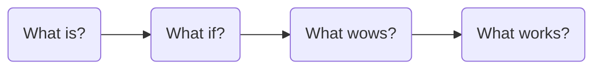

# Humanising complex projects through design thinking and its effects

  
    Madalin Giurca - Software Project Management
  

<!--
disclaimer: the research is focused on analysis and improving design thinking != compare with other PM styles
-->

---
transition: slide-left
---

# Agenda

1. Problem
2. Solution
3. Evaluations
4. Conclusions

---
transition: slide-left
---

# Problem - one complex project

- complex projects cannot rely on math and technology indefinitely
- complex or "mega projects" often engages market and non-market stakeholders as well
- while software, technologies, mathematical models are easily predictable, humans are not

---
transition: slide-left
---

# Problem - stakeholder alignment

When **innovation** wants to be taken into consideration for a project, the likelihood of stakeholders to be driven by
different views is higher.

## But why is it happening?

1. **Market vs non-market**
    - Think about building a bridge in a remote area compared to the same bridge in a dense populated area inside the
      city
2. **Cultural differences**
    - Starting from differences inside the organisation up to collaboration between multiple entities to achieve a goal
3. **Irrationality appearance**
    - Chasing different goals, the difference between success and failure can be the ability to work productively with "
      irrational" stakeholders

---
transition: slide-left
layout: fact
---

  <h1> Design Thinking </h1>

"an approach as offering the Project Management field a set of social technology tools to accompany those that digital
technology has made possible"

---
transition: slide-left
---

# Solution

## Design thinking process

<li><b>What is?</b> - generates knowledge by engaging stakeholders to discuss the solutions already in place</li>
<li><b>What if?</b> - idea generation process by removing the constraints and experimenting through prototyping</li>
<li><b>What wows?</b> - any hypothesis placed under testing for desirability and viability</li>
<li><b>What is?</b> - one higher fidelity prototype should exist and ready to be shaped for implementation</li>

<!--
1 = research, design criteria | personas, job, journey mapping, posters
2 = brainstorming, develop concept | the worst idea, change perspective, thief and doctor
-->

---
transition: slide-left
---

# Evaluations

Two projects implemented in UK having the same goal:

***A viaduct crossing a massive lake in an area full of recreational activities.***

***
First group

- lack of community input
- rejection from local authorities
- designed as an imposing structure opposed to community views

Second group

- adopted a Design Thinking approach <fluent-brain-circuit-24-filled class="text-xl mx-2 animate-pulse"/>
- before a redesign took place there were other steps involved
- using the framework, the group tried to reach the public opinion on prototypes

<!--
community = non-market stakeholder
signature structure - interesting from market stakeholder pov

other steps involved: workshops, community meetings, architects, urban planners, etc
-->

---
transition: slide-left
---

# Measurements*

1. Benchmark Design vs Traditional Thinking
2. Employee Satisfaction with Design Projects
3. Customer Involvement
4. Customer Satisfaction
5. Customer Feedback
6. Customer Experience
7. Turnaround Times
8. Design Thinking Process and Activities
9. Design Thinking Capabilities
10. Outcomes and Roadmap Items

*empirical measurements

---
transition: slide-left
---

# Measurements[^2]

   

[^2]: [Design Thinking: a Global Study on Implementation Practices in Organizations from HPI](https://publishup.uni-potsdam.de/opus4-ubp/frontdoor/deliver/index/docId/53466/file/design_thinking_study.pdf)

---
transition: slide-left
---

# Measurements

   

---
layout: fact
transition: slide-left
---

# Conclusions

- More time spent on project design doesn't mean resources wasted
- Design Thinking ~ a framework of tools and approaches on project planning

<!--
Design thinking is not here to replace traditional project management approaches, but to enhance

-->

---
layout: statement
---

# Thanks for your time!

  <h1>Any questions?</h1>

